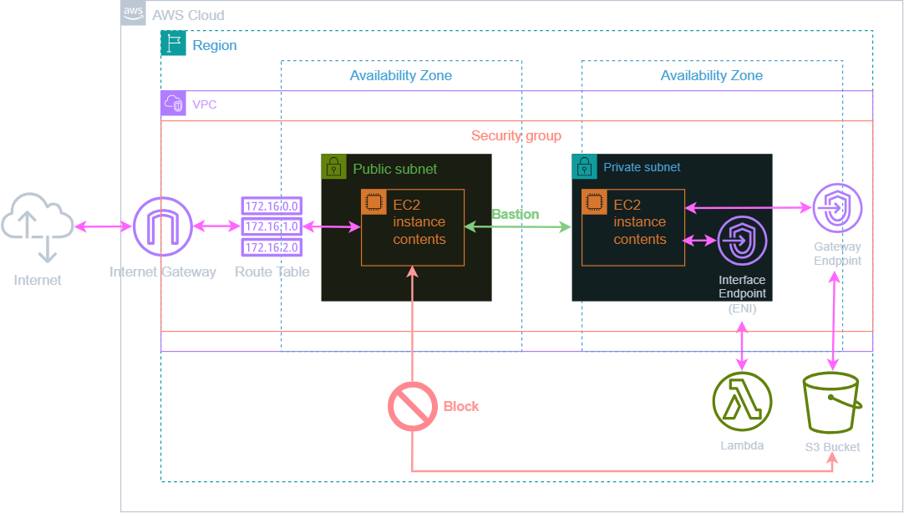

# AWS VPC Endpoints with S3 Access Control

展示如何用 VPC Endpoints 控制 AWS 資源存取的 Terraform 專案。

專案包含 S3 Gateway Endpoint 和 Lambda Interface Endpoint 兩種 VPC Endpoint，並使用 S3 Bucket Policy 限制只有 private subnet 的 EC2 可以存取 S3。

## 架構說明



**VPC Endpoint 類型**
- **Gateway Endpoint**（S3、DynamoDB）- 免費，透過路由表設定，在此專案用於 S3
- **Interface Endpoint**（其他服務）- 按小時和流量計費，使用 ENI，在此專案用於 Lambda

**存取控制機制**
- Public EC2 雖然有 S3 Full Access IAM 權限，但因為 bucket policy 使用 `aws:SourceVpce` 條件限制只接受來自特定 VPC endpoint 的請求而無法訪問
- Private EC2 透過 S3 Gateway Endpoint 訪問，符合 bucket policy 條件，可以正常存取
- Bucket policy 額外使用 `ArnNotEquals` 排除本機 IAM 使用者和 AWS 服務的 assumed-role，避免 Terraform 操作和服務整合被 VPC endpoint 限制擋住

## 環境需求

- 安裝 [Terraform](https://www.terraform.io/)
- 配置 [AWS CLI Profile](https://docs.aws.amazon.com/zh_tw/cli/v1/userguide/cli-configure-files.html#cli-configure-files-format-profile)

## SSH Key 配置

這個專案會建立 EC2 實例，需要 SSH Key 來進行連線測試。

如果還沒有 SSH Key，請執行以下命令生成：
```bash
ssh-keygen -t ed25519 -f ~/.ssh/terraform-ec2
```

這會產生兩個檔案：
- `~/.ssh/terraform-ec2` - 私鑰（保管好，不要分享）
- `~/.ssh/terraform-ec2.pub` - 公鑰（Terraform 會上傳到 AWS）

公鑰會被上傳到 AWS 作為 Key Pair，讓你可以用私鑰 SSH 連線到 EC2 實例進行測試。

## 快速開始

1. **複製範例配置文件**
   ```bash
   cp terraform.tfvars.example terraform.tfvars
   ```

2. **客製化你的配置**
   ```bash
   vim terraform.tfvars
   ```

3. **初始化並部署**
   ```bash
   terraform init
   terraform plan
   terraform apply
   ```

4. **測試連線**
   
   > **💡 提示：** 部署完成後會 output 以下連線字串，可直接複製使用
   
   連接 Public EC2：
   ```bash
   ssh -i ~/.ssh/terraform-ec2 ec2-user@<public_ec2_ip>
   ```
   
   連接 Private EC2（透過 Bastion）：
   ```bash
   ssh -o "ProxyCommand=ssh -i ~/.ssh/terraform-ec2 -W %h:%p ec2-user@<public-ip>" -i ~/.ssh/terraform-ec2 ec2-user@<private-ip>
   ```

5. **使用完畢，清理資源**
   ```bash
   terraform destroy
   ```

## 檔案結構

```
📁 terraform-aws-vpc-endpoints/
├── 📄 data.tf                    # 集中管理所有 data sources
├── 📄 providers.tf               # Terraform 和 AWS provider 配置
├── 📄 variables.tf               # 變數定義
├── 📄 terraform.tfvars.example   # 變數值範例
├── 📄 network.tf                 # VPC、Subnet、Route Table 配置
├── 📄 security.tf                # Key Pair 和 Security Group
├── 📄 compute.tf                 # EC2 實例配置
├── 📄 iam.tf                     # IAM Role 和 Instance Profile
├── 📄 vpc-endpoints.tf           # VPC Endpoints 配置
├── 📄 s3.tf                      # S3 Bucket 和相關安全設定
├── 📄 outputs.tf                 # 輸出值定義
├── 📄 .gitignore                 # Git 忽略文件配置
├── 📄 README.md                  # 專案說明文件
└── 📁 docs/                      # 架構圖文件
```

## ⚠️ 注意事項

- S3 bucket 啟用 `force_destroy = true`，destroy 時會刪除所有物件
- 預設允許所有 IP SSH (0.0.0.0/0)，生產環境請限制來源 IP
- IAM role 同時給予 S3 和 Lambda Full Access，僅供示範
- Public EC2 作為跳板機用途，實際環境建議使用 AWS Systems Manager Session Manager
